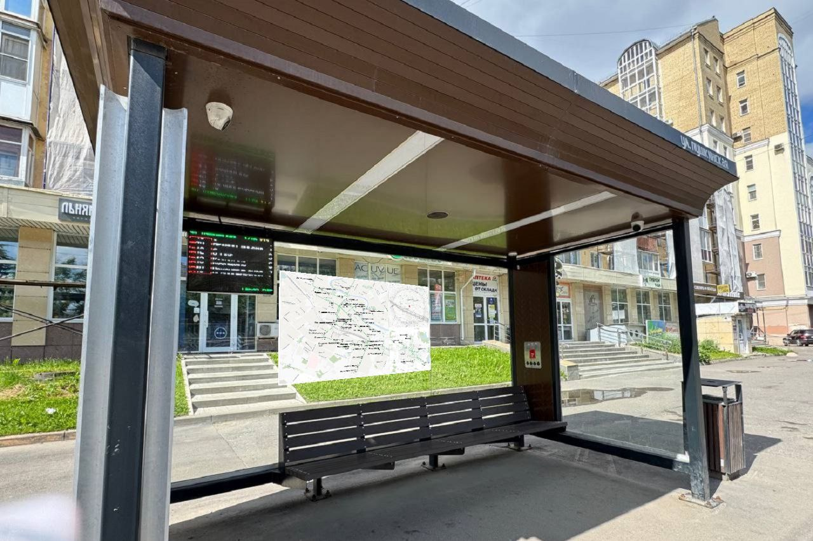

# GeoTransportMap

Генератор постерных карт для автобусных остановок: базовые слои из OpenStreetMap. Выход — статичные PNG для печати.

## Примеры изображений

**Подробная схематика**  


**Как может выглядеть в реальном мире**  


## Быстрый старт

```bash
python ./src/transport_posters/main.py --area-id 2206549 --render-map --render-routes --limit 3
```

### Параметры

| Параметр          | Описание                                                                     |
|-------------------|------------------------------------------------------------------------------|
| `--render-map`    | Флаг для рендеринга подложки карт (фоновые карты для маршрутов)              |
| `--render-routes` | Флаг для рендеринга самих маршрутов                                          |
| `--limit`         | Количество остановок, для которых будут сгенерированы плакаты                |
| `--area-id`       | ID Relation в OpenStreetMap (OSM), внутри которого ищутся маршруты и границы |

**Примеры ID городов:**

- [`1614795` — Вологда](https://www.openstreetmap.org/relation/1614795)
- [`2206549` — Люблин](https://www.openstreetmap.org/relation/2206549)


### Результаты рендера

- `output/maps/` — итоговые PNG-карты (при запуске `generate_maps`)
- `output/logs/` — логи запуска
- `output/composed_img/` — составные постеры (при запуске `generate_tree_in_one`)

## Структура проекта

```
GeoTransportMap/
├─ cache/                         # Runtime cache
├─ data/
│  ├─ cache/                      # Кэш данных
│  ├─ processed/                  # Обработанные данные от OSM (формат Parquet)
│  ├─ raw/                        # Сырые данные о транспорте из OSM
│  └─ map/                        # Кэш тайлов по слоям (tile=zoom-x-y)
├─ docs/
│  ├─ images/                     # Изображения для README.md
├─ output/
│  ├─ composed_img/               # Составные постеры
│  ├─ logs/                       # Логи запуска
│  ├─ maps/                       # Итоговые PNG-карты
├─ src/
│  ├─ transport_posters/
│  │  ├─ data_map/                # Получение данных о карте от OSM + стилизация
│  │  ├─ data_transport/          # Получение маршрутов от OSM и построение CityRouteDatabase
│  │  ├─ generate_maps/           # Базовый генератор плакатов
│  │  ├─ generate_three_in_one/   # Несколько детализаций карты в один постер
│  │  ├─ render_map/              # Отображение карты на фигуре
│  │  ├─ render_transport/        # Отображение транспорта на фигуре
│  │  ├─ utils/                   # Вспомогательные модули
│  │  ├─ __init__.py
│  │  ├─ load_configs.py          # Загрузка конфигов проекта
│  │  ├─ logger.py                # Логирование
│  │  ├─ main.py                  # CLI-вход
├─ style/
│  ├─ assets/
│  │  ├─ fonts/                   # Шрифты
│  │  ├─ patterns/                # Паттерны для карт
│  ├─ detailed_city_layers.json
│  ├─ detailed_city_layers_small.json
│  ├─ detailed_city_layers_v2.json
│  ├─ far_city_layers.json
│  ├─ far_city_layers_labeled.json
│  ├─ general_city_layers.json
│  ├─ general_city_layers_small.json
```
